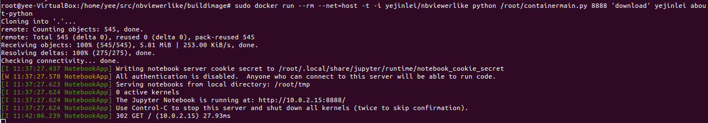
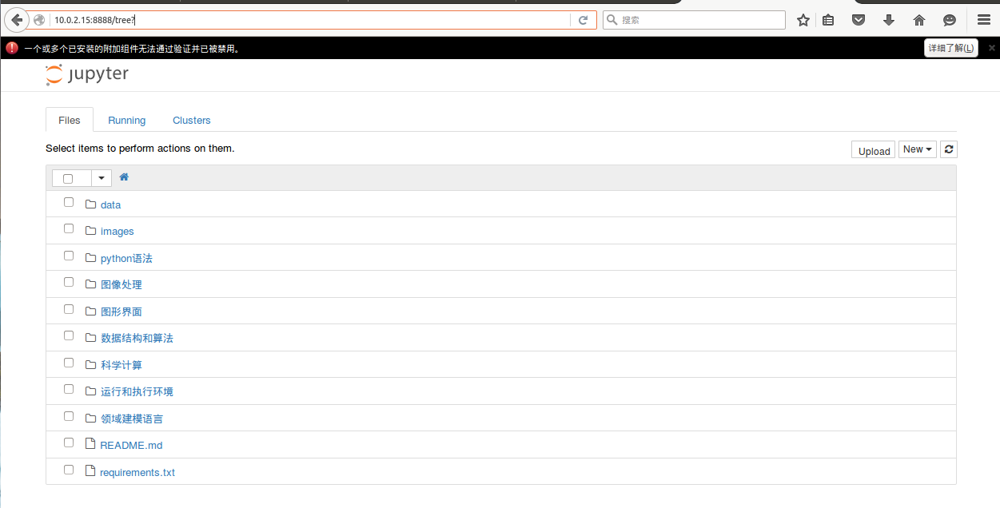

# nbviewerlike
---
## 独立运行容器，内置jupyter notebook
- docker pull yejinlei/nbviewerlike #下载镜像
- docker run --rm --net=host yejinlei/nbviewerlike python /root/containermain.py 8888 'create'   #启动notebook，创建临时笔记本
- docker run --rm --net=host yejinlei/nbviewerlike python /root/containermain.py 8888 'download' yejinlei about-python #拉取https://github.com/yejinlei/about-python，并启动notebook
 
 

## 类似nbviewer网站
- 通过web界面，对外提供notebook服务(同nbviewer，由web后台提供);
- 拉取github上的notebook(同nbviewer，由容器提供);
- 创建临时notebook(nbviewer不具备创建临时笔记本功能，由容器提供);